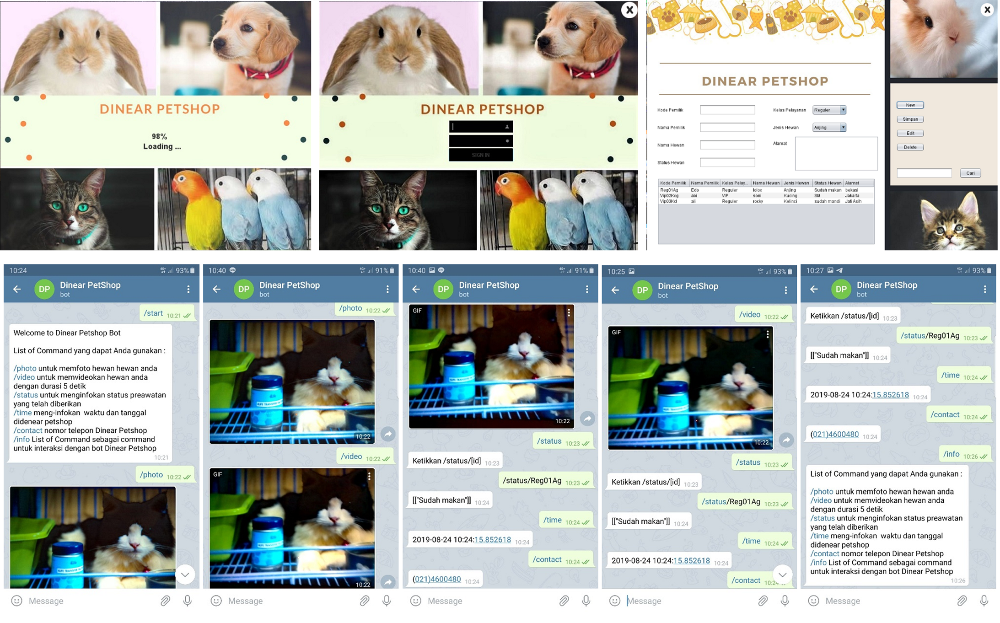

# Project Penulisan Ilmiah
Implementasi Aplikasi Monitoring Peliharaan dan Penitipan Hewan Berbasis Telegram Bot untuk Petshop, dimana aplikasi dibuat menggunakan Java dengan framework Netbeans sebagai input data pelanggan dan bot sebagai output informasi penitipan hewan. Dan untuk mengkoneksikan antara aplikasi dengan telegram bot melalui microcontroller Raspberry Pi 3 Model B+ dengan mengakses database MySQL, yang kemudian dipanggil melalui bot koding(python) dan didalamnya juga untuk mengakses telegram dengan API Telegram.

